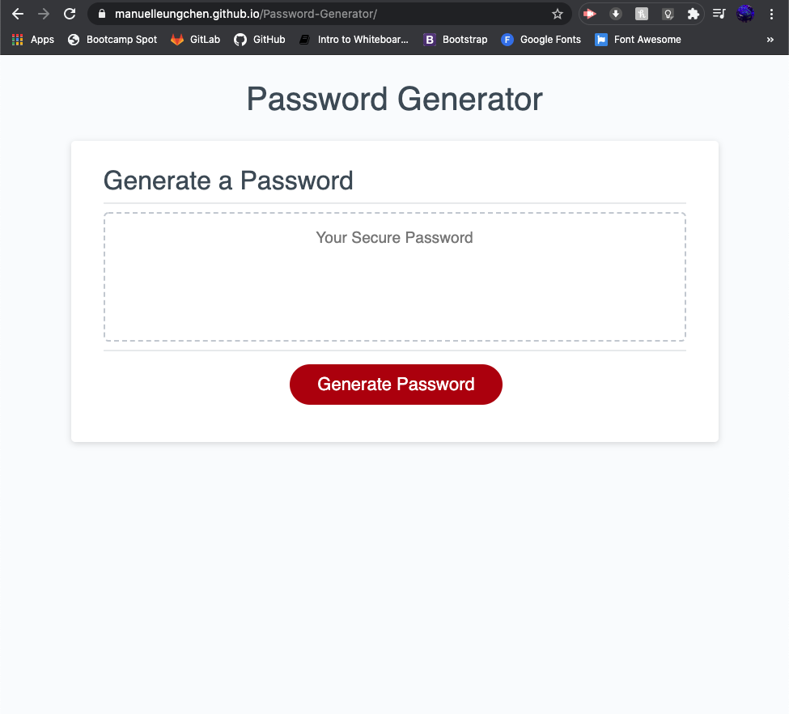

   

# Password Generator

## Description
This repository **\([Password-Generator](https://github.com/manuelleungchen/Password-Generator)\)** contains a Web Application that generates a random password based on user criteria. The languages use on this website are **HTML 5**, **CSS**, **Bootstrap** and **JavaScript**. This source code is available to everyone under the standard [MIT license](https://github.com/manuelleungchen/Password-Generator/blob/main/LICENSE).

## Features
* Minimalistics User Interface
* Random Password Generation
* Password length can be between 8 and 128 characters
* Always contains at least character of each criteria
* Lowercase, uppercase, number and special characters can be pick
* Space character can be allow 

## Instructions
1. Go to [Password Generator Web Application](https://manuelleungchen.github.io/Password-Generator/)
2. Click on Generate Password button
3. Enter Password Length (8-128 characters)
4. Confirm lowercase, uppercase, number and special characters
5. Click on textarea to copy save password to Clipboard
6. Paste password

## Credits
All changes and improvements were implemented by:

Manuel Leung Chen [GitHub](https://github.com/manuelleungchen)

## License
Copyright \(c\) Microsoft Corporation. All rights reserved.

Licensed under the [MIT license](https://github.com/manuelleungchen/Password-Generator/blob/main/LICENSE).
